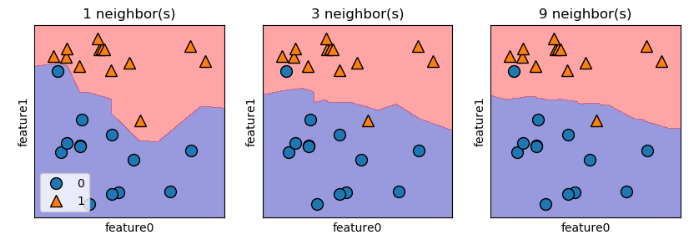
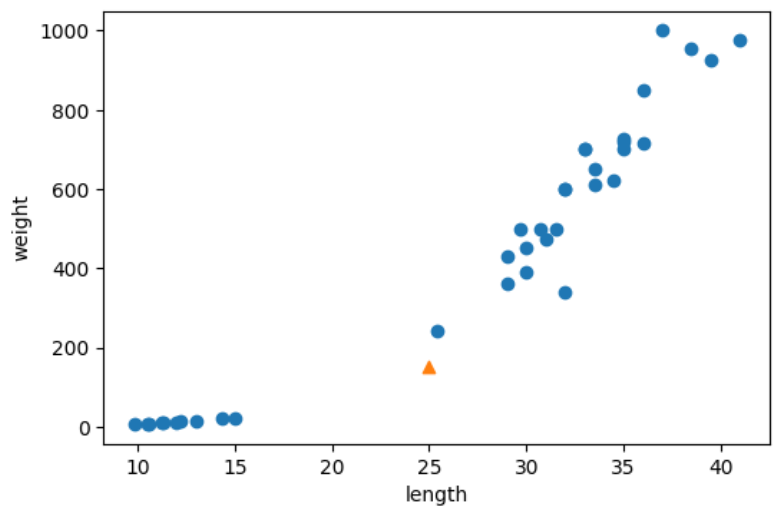
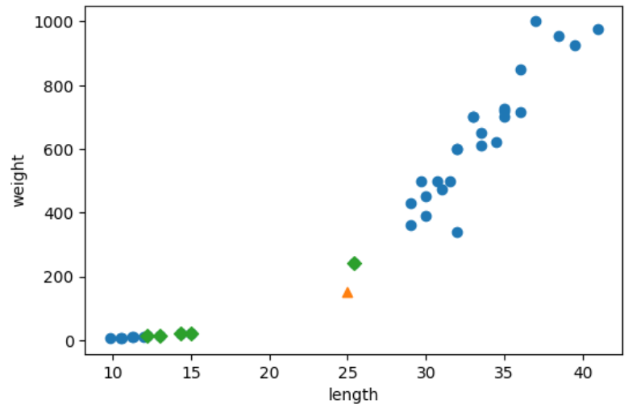
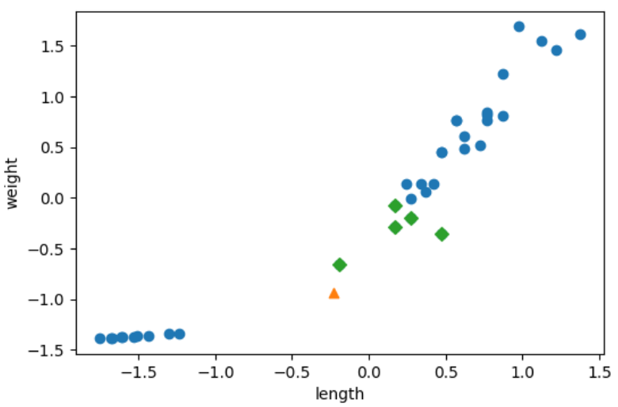

# 1-3 머신러닝
## 인공지능
- 강인공지능
- 약인공지능

## scikit-learn
: 알고리즘 유익성 증명 &rarr; 라이브러리에 추가
>>> why 파이썬 ?  
: 배우기 쉽고 컴파일하지 않아도 되기 때문에 사용하기 편리함

## markdown
|형식|설명|예제|
|-|-|-|
|# 제목1|\<h1> 태그와 동일|<h1>제목1|
|## 제목2|\<h2> 태그와 동일|<h2>제목1|
|## 제목3|\<h3> 태그와 동일|<h3>제목1|
|## 제목4|\<h4> 태그와 동일|<h4>제목1|
|## 제목5|\<h5> 태그와 동일|<h5>제목1|
|\*기울여서\*<br>\_기울여서_|기울여 씀|*기울여서*<br>_기울여서_|
|\*\*굵게\*\*<br>\_\_굵게__|굵게 씀|**굵게**<br>__굵게__|
|\*\*\*기울여서\*\*\*<br>\_\_\_기울여서\_\_\_|굵게+기울여 씀|***굵게+기울여서***<br>___굵게+기울여서___|
|\~\~취소선\~\~|취소선|~~취소선~~|
|\`코드\`|코드 서체|`코드`|
|\>|들여쓰기 혹은 참조|>참조|
|* 글머리 기호<br>- 글머리 기호|글머리 기호|* 글머리 기호<br>- 글머리 기호|
|\[제목](주소 링크)|하이퍼링크|[제목](링크)|
|\!\[제목](이미지 링크)|이미지 추가||
|$ y = x \times z $|LaTeX<br>(라테흐)<br>(레이테흐)<br>문서 저작도구|$y = x \times z$|

## 데이터 준비
- 특성 (feature) : 데이터의 특징
- 클래스 (class) : 최종적으로 데이터를 분류, 예측할 label

```python
from sklearn.neighbors import KNeighborsClassifier

kn = KNeighborsClassifier() # 객체 생성

kn.fit(fish_data, fish_target) # 훈련시키는 메소드

kn.score(fish_data, fish_target) # 평가하는 메소드
# > 1.0

kn.predict([[30, 600]]) # 예측하는 메소드
# > array([1])

print(kn._fit_X) # 학습에 이용한 data가 들어 있는 속성 
#  > [[  25.4  242. ]
#  [  26.3  290. ]
#  [  26.5  340. ]
#  [  29.   363. ]
#  [  29.   430. ]
#  [  29.7  450. ]
#  [  29.7  500. ]]

print(kn._y) # 학습에 이용한 target이 들어 있는 속성
# > [1 1 1 1 1 1 1 1 1 1 1 1 1 1 1 0 0 0 0 0 0]

kn49 = KNeighborsClassifier(n_neighbors=49) # KNeighborsClassifier 클래스의 기본값은 5. 예측할 데이터 주변에서 참조할 label의 갯수. n_neighbors의 값이 커질수록 경계가 부드러워진다

kn49.fit(fish_data, fish_target)
kn49.score(fish_data, fish_target)
# > 0.7142857142857143

kn = KNeighborsClassifier()
kn.fit(fish_data, fish_target)

for n in range(5, 50):
    kn.n_neighbors = n
    score = kn.score(fish_data, fish_target)

    if score < 1: # 100% 맞추지 못하기 시작하는 출력
        print(n, score)
        break

# > 18
# > 0.9795918367346939
```



# 2-1 훈련 세트와 테스트 세트
- 훈련 세트
  - 입력 (input)
    - 특성1 : 꽃잎의 너비
    - 특성2 : 꽃잎의 무게
  - 타깃 (target)
    - = 클래스 : 특정 꽃
<br><br>
- 테스트 세트

```python
train_input = fish_data[:35] # 데이터를 훈련 세트와
train_target = fish_target[:35]

test_input = fish_data[35:] # 테스트 세트로 나눔
test_target = fish_target[35:] # (리스트의 슬라이싱을 통해)

import numpy as np

np.random.seed(42)
index = np.arange(49)
np.random.shuffle(index) # 샘플링 편향을 막기위해 섞어줌

input_arr = np.array(fish_data) # 2차원 이상의 차원에서는 넘파이의 배열로 조작하는게 수월 (리스트 형식보다)
target_arr = np.array(fish_target)

train_input = input_arr[index[:35]]
train_target = target_arr[index[:35]]

test_input = input_arr[index[35:]]
test_target = target_arr[index[35:]]
```

# 2-2 데이터 전처리

```python
from sklearn.model_selection import train_test_split

train_input, test_input, train_target, test_target = train_test_split(fish_data, fish_target, random_state=42, straify= fish_target)

### train_test_split 옵션 (파라미터)
# test_size : 데이터 중 테스트 셋의 구성 비율 (default = 0.25)
# train_size : 위 test_size 와 반대 파라미터
# shuffle : (default = True)
# stratify : '계층화하다', target 으로 주면 클래스의 비율을 train/validation 나눌때 그대로 적용해서 분배됨  (default = None)
# random_state : int값 (default = None)

print(test_target)
# > [1. 0. 0. 0. 1. 1. 1. 1. 1. 1. 1. 1. 1.]
# 클래스의 비율 [0.] : [1.] = 1 : 2.5 이어야 하는데
# 샘플링 편향으로 [0.] : [1.] = 1 : 3.3 으로 나뉘었음

print(test_target)
# > [0. 0. 1. 0. 1. 0. 1. 1. 1. 1. 1. 1. 1.] # stratify 매개변수 적용 후
```



> 가로, 세로의 스케일(scale)이 다르기 때문

### 데이터 전처리
: 거리를 기반으로 하는 알고리즘의 경우 샘플 간 거리 특성(feature)을 일정한 기준으로 맞춰줘야 한다. 이에 필요한 작업.  
*cf)* <u>트리 기반 알고리즘</u> 같은 경우는 거리 기반이 아니므로 특성의 스케일이 다르더라도 잘 작동함

- 가장 많이 사용하는 전처리 방법 : **표준점수 (z 점수)** 

```python
mean = np.mean(train_input, axis=0) # 배열의 평균 계산
std = np.std(train_input, axis=0) # 배열의 표준편차 계산
train_scaled = (train_input - mean) / std # 표준점수로 변환

# 브로드캐스팅(broadcasting)
# : 각 배열에 스칼라 값을 연산해주는 (빼고, 나누기) 넘파이의 기능

kn.fit(train_scaled, train_target)

test_scaled = (test_input - mean) / std

new = ([25, 150] - mean) / std
distances, indexes = kn.kneighbors([new])

plt.scatter(train_scaled[:,0], train_scaled[:,1])
plt.scatter(new[0], new[1], marker='^')
plt.scatter(train_scaled[indexes,0], train_scaled[indexes,1], marker='D')
plt.xlabel('length')
plt.ylabel('weight')
plt.show()
```



# 3-1 K-최근접 이웃 회귀
: K-Nearest Neighbor Regression
- KNN classification 처럼 예측하려는 샘플에 가장 가까운 샘플 k개 선택
## 차원
> scikit-learn 에서 사용할 훈련 세트는 **2차원 배열** 이어야 한다

```python
test_array = np.array([1,2,3,4])
print(test_array.shape)
print(test_array)
# > (4,)
# > [1 2 3 4] # 1차원

test_array = test_array.reshape(2, 2) 
print(test_array.shape)
print(test_array)
# > (2, 2)
# > [[1 2]
#    [3 4]] # 2차원

train_input = train_input.reshape(-1, 1) # 
test_input = test_input.reshape(-1, 1)

from sklearn.neighbors import KNeighborsRegressor

knr = KNeighborsRegressor()
knr.fit(train_input, train_target)

knr.score(test_input, test_target) # 결정계수 R^2
```
$$ 결정계수 \quad R^2 = 1 - \frac{(타깃 - 예측)^2의 합}{(타깃 - 평균)^2의 합} $$
$$ R^2 = 1 - \frac{Sum\;of\;the\;Residuals\;Squared}{Total\;Sum\;of\;Squares} $$
$$ (Residuals)^2 : 잔차^2$$
> 분류의 경우, kn.score = 정확도 (맞힌 개수의 비율)  
> 회귀의 경우, knr.score = 결정계수 (정확히 맞힌다는게 불가능하기 때문. 근사값으로 예측할 뿐)

```python
from sklearn.metrics import mean_absolute_error

test_prediction = knr.predict(test_input)
mae = mean_absolute_error(test_target, test_prediction)

```
