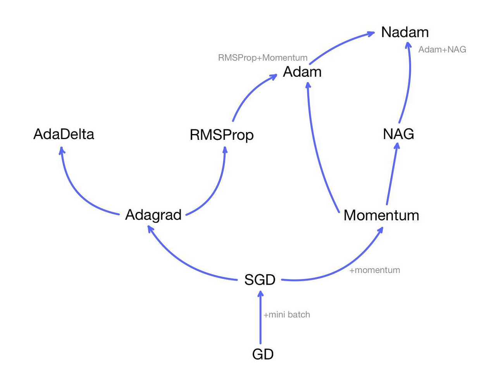
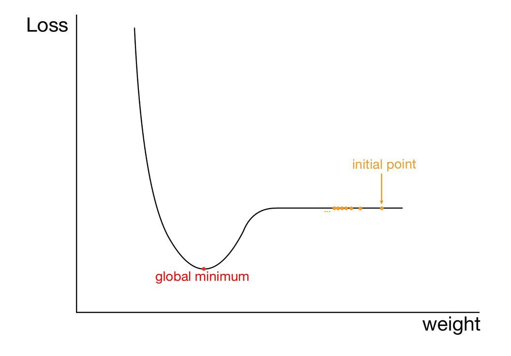

# 02 인공지능의 딥러닝 알고리즘
## 순전파
y = w \* x + 1 \* b # 단일 인공 신경에서  
w=3; b=1; # 초기값  
x=2; # 입력일 때, 출력은?  
&rarr; y=7

## 역전파 시의 오차
y=7; # 출력일 때  
t=10; # 목표값  
yb = △y = y - t = -3 # 역전파 오차  

## 역전파
> x가 w만큼 y로 왔으니, 거꾸로 yb도 w만큼 xb로 가야한다  


xb=yb \* w  &rarr; xb=-9  
wb=yb \* x  &rarr; wb=-6  
bb=yb \* 1  &rarr; bb=-3  

## 순전파 검증
y = w \* x + 1 \* b $\quad$ &rarr;   
y = (w-wb) \* x + 1 \* (b-bb)  
y = 9 \* x + 1 \* 4  
x=2; # 다시 대입  
y=22; # 결과값이 목표했던 10이 안나옴 (너무 큰 값이 나옴)  

## 학습률
y = (w- wb \* lr) \* x + 1 \* (b- bb \* lr)  
lr=0.1; 학습률  
y = 9 \* x + 1 \* 4  

## 반복 학습
```python
w=3; b=1; lr=0.1;
x=2; t=10;

for epoch in range(200):
    y = w*x + 1*b
    
    yb = y - t
    xb = yb*x
    wb = yb*x
    bb = yb*1

    w = w - wb*lr  
    b = b - bb*lr
    if y=t:
        break  
```

## 오차 계산
```python
E = (y-t)**2 / 2 # 손실 함수 = 비용함수 = mean square  
if E < 0.0001:  
    break
```

## 활성화 함수
### what, why?
: 신경망을 거친 입력값이 출력이 될 때 우리가 원하는 목표값에 더 쉽고, 빠르게 도달하게 해주는 함수  
활성화함수로부터의 출력값 y = w\*x + 1\*b 이 어떤 범위로 제한되지 않으면 매우 커질 수가 있음 (수백만 개의 매개변수를 거치면서)  

### 종류
1. **sigmoid**  
  순전파 : 
  $$ y = \frac{1}{1+e^{-x}} $$
  역전파 : 
  $$ x_b = y * (1-y) * y_b $$
  > 순전파의 출력 y 가 0 이나 1 에 가까울수록 역전파 yb 값은 0 에 가까워짐
  - 역사적인 이유로 소개되며 일반적으로 딥러닝에서 많이 사용되지는 않음
  - layer 3층 정도까지는 학습이 잘 되지만 더 깊은 신경망에서는 학습이 잘 되지 않음
  - 입력값이 아무리 크더라도 출력값의 범위가 0~1 이므로 신경망을 거칠수록 출력값은 점점 작아져 0 으로 수렴
  - 역으로 전달될 신호도 아주 작거나 거의 없음을 의미
  - 심층 신경망에서 쓰려면 **출력 층에서만** 사용
  > 시그모이드 함수는 일반적으로 0 이나 1 로 분류하는 이진 분류 문제에 사용됨  
  > **오차함수 : 평균 제곱 오차 (mean squared error) 함수와 같이 사용됨**

2. **softmax**
  - 시그모이드 함수가 일반화된 형태
  - 0~1 사이의 값을 출력
  > 다중 클래스 분류 문제에 출력 층에서만 사용  
  > **오차함수 : 크로스 엔트로피 오차 (cross entropy error) 함수와 같이 사용됨**

3. **tanh**  
  순전파 : 
  $$ y = tanh{(x)} $$
  역전파 : 
  $$ x_b = (1+y) * (1-y) * y_b $$
  > 순전파의 출력 y 가 -1 이나 1 에 가까울수록 역전파 yb 값은 0 에 가까워짐
  - -1~1 사이의 값을 출력
  - 시그모이드처럼 많이 사용되지 않음

4. **ReLU**  
  순전파 :  
  $$ y = (x>0) * x $$  
  역전파 :  
  $$ x_b = (y>0) * 1 * y_b $$
  > 순전파의 출력 y 가 0 보다 크면 x, 0 보다 작거나 같으면 0 이 전달
  - CNN 에서 많이 사용
  - 음수가 될 경우 출력이 0이 되므로 노트가 죽을 수 있음
  - 반대로 활성화값이 무한히 커질 수도 있다 &larr; 초기 가중치 값을 고르게 할당하여 해결
  > 일반적으로  
  > 은닉층 &larr; ReLU  
  > 출력층 &larr; 시그모이드 or 소프트맥스


# 04 텐서플로우 내부 동작 이해하기
## Optimization 최적화 함수 = Optimizer
## 1. 경사 하강법
: 최저점에 도달하기 위해 경사 방향으로 하강하는 방법  
$$ p = p - \alpha  \frac{dE}{dp} \quad (E:오차, p:예측값, \alpha : 학습률) $$
이차 함수에서
$$ E = \frac{1}{2}(p-t)^2 \quad (p:prediction, t:target) $$
```python
import numpy as np
import time

np.random.seed(int(time.time()))
ps = np.random.uniform(-6, 2, 1000) # 균등 분포로부터 무작위 표본 추출 # low=-6, high=2, size=1000
es = 0.5*(ps + 2)**2 # 위쪽의 이차 함수 오차 구하는 식에서 t=-2 일때

p=0 # 0 에서 - 되므로 왼쪽으로 이동
E=0.5*(p+2)**2
lr = 0.5
for i in range(10):
    DpE = p+2 # DPE(direct position error = forecast error)
    p = p - lr*DpE

p=-5 # -5 에서 + 되므로 오른쪽으로 이동
E=0.5*(p+2)**2
lr = 0.5
for i in range(10):
    DpE = p+2
    p = p - lr*DpE
```
## 2. 확장 경사 하강법

1. Momentum
$$ v = mv - \alpha\frac{dE}{dp} (m: 모멘텀) $$
$$ p = p + v (v: 이동 속도) $$
> 모멘텀은 속도를 얼마나 고려할지에 대한 가중치

```python
p=-5 
E=0.5*(p+2)**2
lr = 0.5

v=0
m=0.5

for i in range(10):
    DpE = p+2
    v = v*m - lr*DpE
    p = p + v
```

2. AdaGrad
$$ h = h + (\frac{dE}{dp})^2 $$
$$ p = p - \frac{\alpha}{\sqrt{h}}\frac{dE}{dp} $$
- h 는 경사도를 제곱하여 더해준 값
- 경사가 있는동안 $\sqrt{h}$ 값은 계속해서 커짐
- 결국 경사가 0으로 작아지고 h 값은 일정한 값으로 수렴
- 학습률 $\alpha$ 를 일정한 값 $\sqrt{h}$ 으로 계속 나누어 학습이 되므로
> 학습이 진행될수록 최소 위치를 찾는 속도는 점점 느려지게 됨

```python
p=-5
E=0.5*(ps+2)**2
lr=0.5

h=0
for i in range(10):
    DpE = p + 2
    h = h + DpE*DpE
    p = p - lr*1/np.sqrt(h)*DpE
```

3. RMSProp
$$ h = \rho h + (1- \rho)(\frac{dE}{dp})^2 $$
$$ p = p - \frac{\alpha}{\sqrt{h}}\frac{dE}{dp} $$
- AdaGrad 를 개선한 방법
- 경사도 제곱의 합 h 와 현재 경사도 제곱을 비율적으로 선택
- $\rho$ 값을 조절하여 경사도의 합 및 학습률을 조절할 수 있음

```python
p=-5
E=0.5*(ps+2)**2
lr=0.5

h=0
lo=0.9
for i in range(10):
    DpE = p + 2
    h = lo*h + (1-lo)*DpE*DpE
    p = p - lr*1/np.sqrt(h)*DpE
```

4. Adam
$$ m_t = \beta_1m_{t-1} + (1-\beta_1)\frac{dE}{dp} $$
$$ v_t = \beta_2v_{t-1} + (1+\beta_2)(\frac{dE}{dp})^2 $$
$$ M_t = \frac{m_t}{1-\beta^t_{1}} $$
$$ V_t = \frac{v_t}{1-\beta^t_2} $$
$$ p = p - \frac{\alpha}{\sqrt{V_t} + \epsilon}M_t$$
- Momentum 과 AdaGrad 를 조합한 방법
- 모멘텀에서의 속도 인자 v 와
- AdaGrad에서의 경사도 제곱 및 학습률을 경사도로 나누는 방법을 합침
> 수식에서  
> $m_t$ 는 모멘텀의 v 를, $v_t$ 는 AdaGrad 의 h 를 의미  
> $M_t$, $V_t$ 는 각각 0에 편향되지 않게 하는 역할  
> 보통 $\beta_1$ 로는 0.9, $\beta_2$ 로는 0.999, $\epsilon$ 으로는 $10^{-8}$ 정도의 값을 사용

```python
p=-5
E=0.5*(ps+2)**2
lr=0.5

m=0
v=0
t=0
beta_1=0.9
beta_2=0.999
eps=10**-8

for i in range(10):
    t = t + 1
    DpE = p + 2
    m = beta_1*m + (1-beta_1)*DpE
    v = beta_2*v + (1-beta_2)*DpE*DpE
    M = m/(1-beta_1**t)
    V = v/(1-beta_2**t)
    p = p - lr*M/(np.sqrt(V) + eps)
```
### 블로그 https://yhyun225.tistory.com/ 참고

- 경사하강법의 한계
  1. 많은 연산량과 컴퓨터 자원 소모
  2. Local Minima (지역 극소값) 문제  
   (다만 가중치의 개수가 많아질수록 손실 함수의 critical point 대부분이 saddle point가 되고 local minimum이 될 확률이 매우 희박하다는 의견도 있음)
   
  3. Plateau 현상 (고원 현상)  
   : 기울기가 평탄한 지점에서 결국 최소값까지 가지 못하고 정지해버리는 현상
   
  4. Oscillation (진동) 문제  
   : 진동하며 최적값에 느리게 수렴.  
   진동폭이 크다는 것은 가중치가 불완전하게 수렴한다는 것  
   

- 배치 경사하강법 (BGD, Batch Gradient Descent)  
  = 일반적 경사하강법  
  : 한 번의 가중치 업데이트에 모든 데이터를 사용
  > 데이터가 1000개 있을 때 **모든 batch** 에 대하여 Loss function 계산 후 함수를 최소화하는 방향으로 w 업데이트  
  `# batch : 피자 1조각`
  
- 확률적 경사하강법 (SGD, Stochastic Gradient Descent)
  :  확률적으로(랜덤하게) 데이터를 뽑아 한 번의 반복당 한 개의 데이터를 사용하여 가중치들을 업데이트하는 방법
  > 데이터가 1000개 있을 때 **임의의 1개의 batch** 에 대하여 
  
    - 경사하강법과 달리 SGD는 연산량이 비교적 매우 적어 손실 함수의 최적값에 빠른 수렴 속도를 보이고 메모리 소비량이 적음
- 미니배치 경사하강법(MSGD, Mini-batch Gradient Descent)  
  : BGD보다는 연산량이 적고, SGD보다 안정적으로 수렴한다는 장점
  > 머신러닝에서 'SGD를 이용한다'라고 하면 대부분 '미니배치 경사하강법을 사용한다'
   

# 손실함수 (Loss Function)
: 예측값과 실제값(레이블)의 차이를 구하는 함수
<br><br>
> 손실함수 <= 비용함수 <= 목적함수
- 목적함수 (Objective function)   
  : 어떠한 값을 최대화 또는 최소화시키기 위해 정의되는 함수
  <br><br>
  - 비용함수 (Cost function)
    : 모든 오차를 일반적으로 최소화하기 위해 정의되는 함수  
    :  the average loss over the **entire training dataset**
    <br><br>
    - 손실함수  
      : for a **single training example/input**   

1. 평균 제곱 오차 (MSE, Mean Sqaure Error)
   $$ \frac{1}{n}\sum_{i=1}^n(y_i-\hat{y_i})^2$$
2. 평균 제곱근 오차 (RMSE, Root Mean Square Error)
   $$ \sqrt{\frac{1}{n}\sum_{i=1}^n(y_i-\hat{y_i})^2}$$
3. 바이너리 크로스 엔트로피 (Binary Cross-entropy)
   $$ -\frac{1}{n}\sum_{i=1}^n(y_i\log{\hat{y_i}}+(1-y_i)\log{(1-\hat{y_i}})$$
4. 카테고리컬 크로스 엔트로피 (Categorical Cross-entropy)
   $$ -\sum_{i=1}^ny_i\log{(a_i)}$$

